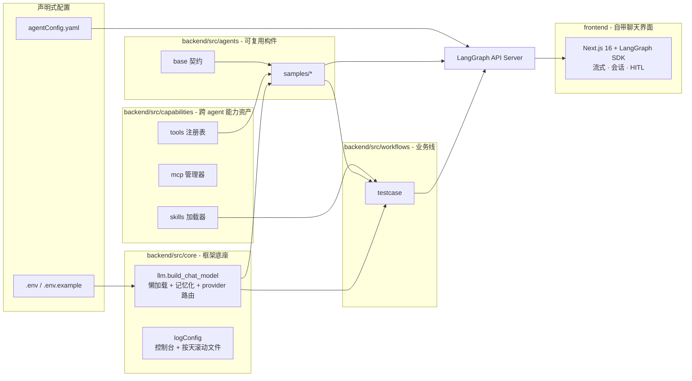

# AgentSeed

> **基于 LangGraph 的全栈、工程化 Agent 框架。** 一条命令拉起一个 LangGraph API Server，
> 自带**共享 LLM 工厂**、**按名字解析的工具注册表**、**技能资产**（内联或渐进式披露）
> 和 **8 个开箱即用的 graph**；同一个仓库还自带 **Next.js 16 聊天前端**（`frontend/`），
> 提供流式对话、会话历史、工具调用可视化、人机协同审批与任务/文件面板 ——
> 不需要 `langgraph.json`，没有样板代码，也不需要 Docker 或 `langgraph-cli`，只要 Python 和 `uv`。

AgentSeed 的适配亮点：除了同类 Agent 框架普遍仅支持独立 LLM 循环或LangGraph 单一链路；AgentSeed 支持对接客户现存 HermesAgent 桥接与双协议兼容，无需推倒重建原有智能体资产

<p align="center">
  
</p>

[English](README.md) · [简体中文](README-zh.md)


```bash
git clone https://github.com/yiyang-aistack/AgentSeed && cd AgentSeed
cp .env.example .env          # 默认走本地 Ollama，无需任何 API Key
ollama pull qwen2.5:7b        # 只需执行一次

# 1) 后端 —— LangGraph API Server
uv sync && uv run backend/main.py     # → 📍 http://localhost:2026   📚 /docs   💚 /ok

# 2) 前端 —— 自带聊天界面（独立应用，可选）
cd frontend && yarn install && yarn dev
# → 💬 http://localhost:3000   配置 AI Worker URL=http://localhost:2026、AI Worker ID=test_agent
```

启动成功的样貌 —— 左侧后端、右侧前端：


---

## 一句话概括

| | |
|---|---|
| **直接得到一个真服务** | `uv run backend/main.py` 本地启动官方 **LangGraph API Server**（内存运行时 + 文件持久化），`/assistants`、`/threads`、`POST /runs/stream`、`/docs` 全部开箱可用。 |
| **Graph 立刻可调用** | [`agentConfig.yaml`](agentConfig.yaml) 中已注册 8 个 graph，按名字即可调用：`test_agent`、`agent2`、`reflect_agent`、`testcase_agent`、`skill_testcase_agent_local_getText`、`skill_testcase_agent_local_skillMiddleware`、`mcp_agent`、`hermes_agent` —— 这些正是 `POST /assistants/search` 返回的 id。 |
| **完全离线可跑** | 默认 provider 是本地 **Ollama** 模型（`qwen2.5:7b`），不需要网络与密钥。 |
| **一行切到在线模型** | 设 `LLM_PROVIDER=openai`，把 `OPENAI_BASE_URL` 指向任意 OpenAI 兼容端点（DeepSeek / 通义 / 智谱 …），**无需改动任何业务代码**。 |
| **扩展以分钟计** | 加 Agent = 1 个文件 + 1 行 YAML；加 Tool = `@tool` + 1 条注册；加专家知识 = 1 个 markdown 文件。 |
| **自带聊天前端** | `frontend/` 是 **Next.js 16 + React 19 + Tailwind** 聊天客户端，直连同一个服务：流式回复、会话历史、PDF/图片附件、工具调用可视化、HITL 批准/编辑/拒绝、文件面板 —— 见 [`frontend/README.zh-CN.md`](frontend/README.zh-CN.md)。 |

---

## 为什么选 AgentSeed？

市面上的 Agent 仓库通常是两个极端：要么是 20 行脚本，一天就撑不住；要么是重框架，得花一个
周末去"掰弯"它。AgentSeed 站在中间：**工程脚手架已经写好**（配置单一真源、懒加载的共享 LLM、
能力分层、按天滚动日志、Windows UTF-8 处理），而 agent 代码依然小到可以一次读完。

| | 手写脚本 | 全功能 Agent 平台 | **AgentSeed** |
|---|---|---|---|
| 可直接调用的 REST API | ✗ | ✓（配置繁琐） | ✓ `uv run backend/main.py` |
| 全局唯一共享 LLM 实例 | 通常 ✗ | ✓ | ✓ 记忆化工厂 |
| 工具跨 agent 复用 | ✗（复制粘贴） | ✓ | ✓ 命名注册表 |
| 提示词/知识作为资产 | 内联字符串 | 部分支持 | ✓ markdown 技能，可内联也可惰性披露 |
| 不改代码切换 provider | ✗ | 部分支持 | ✓ `LLM_PROVIDER` |
| 按天滚动的文件日志 | ✗ | ✗ | ✓ `logs/agentseed.log.YYYYMMDD` |
| 小到能真正读完 | ✓ | ✗ | ✓ |
| 自带聊天前端（同仓库） | ✗ | 部分支持 | ✓ `frontend/` |

---

## 架构



### 目录结构

```
AgentSeed/
├── backend/                  # Python 侧 —— LangGraph API Server
│   ├── main.py               #   入口：加载 ../.env + ../agentConfig.yaml，启动 uvicorn
│   ├── localAgent.py         #   独立的 Ollama 试验脚本（不会被服务导入）
│   └── src/
│       ├── __init__.py       #   记录三层正交结构的设计约定
│       ├── core/             #   底座 —— 领域无关基础设施
│       │   ├── llm.py        #     chat model 的单一真源
│       │   └── logConfig.py  #     uvicorn dictConfig + 仿 Tomcat 按天滚动
│       ├── agents/           #   构件 —— 可复用/可组合的 agent 单元
│       │   ├── base.py       #     AgentMeta + assert_agent_ready 契约
│       │   └── samples/      #     供复制的示例：
│       │       ├── localAgent.py    # create_agent + 共享工具
│       │       ├── tsAgent.py       # 第二个独立 agent
│       │       ├── reflectAgent.py  # 手写 StateGraph，含 review/revise 循环
│       │       ├── mcpAgent.py      # 工具来自外部 MCP server
│       │       ├── skillAgent_testcase.py   # 专业知识 = 磁盘上的技能库
│       │       └── hermesAgent.py   # 桥接到运行中的 Hermes Agent（本侧无 LLM）
│       ├── capabilities/     #   能力 —— 面向所有 agent 共享
│       │   ├── tools/registry.py    # @tool 定义 + 名称→工具注册表
│       │   ├── mcp/                 # MCP servers：servers.yaml + 生命周期管理器（见下）
│       │   └── skills/entries/      # 提示词/知识资产（markdown 或 .py）
│       ├── workspace/        #   agent 工作区 —— 运行时读取的磁盘素材
│       │   └── testcase/skills/     # 场景技能库（每个目录一个 SKILL.md）
│       └── workflows/        #   业务线 —— 组合以上各层
│           └── testcase/agent.py    # 测试用例生成交付线
├── frontend/                 # 前端 —— Next.js 16 聊天界面（详见 frontend/README.md）
├── agentConfig.yaml          # 服务对外暴露哪些 graph（name → module:attr）
├── .env.example              # 全部支持的变量并带注释            → 复制为 .env
├── pyproject.toml            # 依赖 + uv 配置（脚本应用，非可安装包）
├── Dockerfile                # 多阶段后端镜像（uv 环境 + 源码）
├── docker-compose.yml        # `docker compose up` —— 非敏感默认值 + env_file
├── .dockerignore             # 排除 .env / .venv / frontend / logs 进入镜像
└── logs/                     # 按天滚动的运行时日志（git-ignored）
```

**设计铁律：一个概念只存在于一个目录。**
`agents` 放*可复用构件*，`workflows` 放*面向交付的编排*，两者内容互不重复；
`capabilities` 与二者平级，让任何 agent / workflow 都能挂载 tools / MCP / skills，
而不必跨模块 import 另一个 agent。

`workspace` 是第四类：**agent 运行时读取的数据**，而非它 import 的代码。场景技能库放在那里，
因此它可以作为内容来维护 —— 加一个目录就等于加一个技能，无需改动 Python。

`backend/src` 下的内容有两条寻址路径：Python 代码用 `src.*` 导入（因此 `backend` 在 `sys.path` 上），
而 `agentConfig.yaml` 用 `agents.*` / `workflows.*` 寻址（因此 `backend/src` 在 `sys.path` 上）。
两者都由 `backend/main.py` 建立 —— 这也是本文档统一使用 `uv run backend/main.py` 的原因。

`frontend/` 遵守同一条铁律的另一面：它是一个**独立应用，而不是本 Python 项目的包**，
只通过 LangGraph Platform HTTP API 与后端通信 —— 删掉该目录，后端依然可以单独运行。

---

## 内置 Graph

均在 [`agentConfig.yaml`](agentConfig.yaml) 注册；每个 graph 通过 `module.__dict__[variable]`
解析后由同一个 API 提供服务：

| Graph ID | 源码位置 | 演示了什么 |
|---|---|---|
| `test_agent` | `agents.samples.localAgent:test_agent` | 最小的 `create_agent`，绑定共享工具注册表 |
| `agent2` | `agents.samples.tsAgent:ts_agent` | 第二个独立 agent，复用同一个记忆化 LLM |
| `reflect_agent` | `agents.samples.reflectAgent:reflect_agent` | 手写 `StateGraph`：类型化 state、条件边、有界 review/revise 循环 |
| `testcase_agent` | `workflows.testcase:testcase_agent` | 业务线 workflow，组合底座 + 工具 + 技能 |
| `skill_testcase_agent_local_getText` | `agents.samples.skillAgent_ts:skill_testcase_agent` | 专业知识是**内联**进 prompt 的技能库（`src.capabilities.skills.get_texts`） |
| `skill_testcase_agent_local_skillMiddleware` | `agents.samples.skillAgent_testcase:skill_testcase_agent` | 专业知识是磁盘上的技能*库*，按渐进式披露加载 —— 见[新增一个 Skill](#新增一个-skill) |
| `mcp_agent` | `agents.samples.mcpAgent:mcp_agent` | 工具来自外部 MCP server（`servers.yaml` → Tavily）；该 server 不可达时降级运行而非启动失败 |
| `hermes_agent` | `agents.samples.hermesAgent:hermes` | 桥接到运行中的 Hermes Agent（OpenAI 兼容接口），本侧不配置任何 LLM |

---

## 使用方式

### 1. REST（标准 LangGraph Platform API）

```bash
# 列出已注册的 graph（assistants）
# 注意：直接 `GET /assistants` 会返回 405，检索接口是 POST
curl -X POST http://localhost:2026/assistants/search \
  -H "Content-Type: application/json" -d '{"limit": 10}'

# 流式执行某个 graph
curl -X POST http://localhost:2026/runs/stream \
  -H "Content-Type: application/json" \
  -d '{
        "assistant_id": "test_agent",
        "input": { "messages": [{"role": "user", "content": "上海今天天气怎么样？"}] }
      }'
```

### 2. 交互式文档与 UI

| 地址 | 用途 |
|---|---|
| `http://localhost:2026/docs` | OpenAPI / Swagger，可在浏览器里直接调用所有接口 |
| `http://localhost:2026/ok` | 健康检查 |
| `/assistants`、`/threads`、`/runs/*` | 完整的 LangGraph Platform API（可在 `/docs` 中浏览） |

> **关于服务端自带的 `/ui`：** 这里不可用。`langgraph_api` 仅在内部变量 `LANGGRAPH_UI` 存在
> （通常由 langgraph CLI 从 `langgraph.json` 注入）**且**本机具备 Node.js/`npx` 时才会组装
> Studio bundle。AgentSeed 从不设置 `LANGGRAPH_UI`，因此单靠 `LANGGRAPH_UI_BUNDLER=true`
> 并不会让 `/ui` 可用 —— 请直接使用下面自带的聊天界面。

### 3. 浏览器聊天界面（`frontend/`）

```bash
cd frontend
yarn install
yarn dev          # → http://localhost:3000
```

首次打开时弹出的 **Configuration** 对话框会把配置写入 `localStorage`（键名
`agentseed-config`）。地址必须**浏览器可达**：

| 字段 | 本地取值 |
|---|---|
| AI Worker URL | `http://localhost:2026` |
| AI Worker ID | `agentConfig.yaml` 里的任意 graph id，例如 `test_agent` |


### 4. Python（进程内调用）

```python
from src.core.llm import build_chat_model
from src.capabilities.tools import builtin

model = build_chat_model()            # 全局共享、记忆化实例
tools = builtin(["weather", "current_date"])
```

---

## 自带聊天界面（`frontend/`）

`frontend/` 是基于 LangGraph SDK 的 **Next.js 16（App Router）+ React 19 + Tailwind/shadcn**
客户端，由 [langchain-ai/deep-agents-ui](https://github.com/langchain-ai/deep-agents-ui)（MIT）
定制而来。

| 能力 | 说明 |
|---|---|
| 流式对话 | 使用 `@langchain/langgraph-sdk` 的 `useStream`，自动吸底，`Send ⇄ Stop` |
| 会话 | `threadId` 持久化在 URL；历史侧栏支持状态筛选、时间分组、分页与删除 |
| 附件 | JPEG · PNG · GIF · WEBP · PDF，可点选 / 拖拽 / 粘贴；图片以 `image_url` 传输，PDF 放入 `additional_kwargs.attachments` |
| 工具调用 | pending / completed / error 状态徽标，可展开参数与结果；`task` 调用渲染为子智能体卡片 |
| 人机协同 | 依据 `review_configs[].allowed_decisions` 渲染 批准 / 编辑 / 拒绝，并通过 `command.resume.decisions` 回传 |
| 任务与文件 | `todos` 按状态分组实时展示，外加带语法高亮的文件查看 / 编辑 / 下载 |
| GenUI | 后端下发的组件经 `LoadExternalComponent` 渲染 |

同一个界面桥接到 Hermes Agent —— 唯一的变化是 AI Worker ID 从 `test_agent` 换成 `hermes_agent`，Hermes 侧代码一行未改：


完整功能清单、界面文案与常见问题见 [`frontend/README.zh-CN.md`](frontend/README.zh-CN.md)。

---

## Docker 一键启动（pull & run）

无需在宿主机安装 Python / uv / Node：

```bash
docker compose up -d --build
```

✅ **验证** —— 打开 `http://localhost:2026/docs`，同一套服务、同一个 LangGraph Platform API，零宿主机依赖。

- [`Dockerfile`](Dockerfile) 采用**多阶段构建**：在 `deps` 阶段用 `uv.lock` 解析出 `uv` 环境，最终镜像只保留 venv + 源码。
- [`docker-compose.yml`](docker-compose.yml) 声明了所有**非敏感**默认值 —— `HOST=0.0.0.0`、`PORT=2026`、内存态 LangGraph 运行时、本地 Ollama，零配置即可启动。
- 把你的 `.env` 放到 `docker-compose.yml` 同目录，`env_file` 会叠加到容器上（LLM Key、Hermes 等）；`environment:` 对 `HOST` 始终生效，即使 `.env` 里写的是 `localhost` 也能正常对外。
- `agentConfig.yaml` 默认启用 `hermes_agent`，compose 为其提供了**占位** `HERMES_*` 值以便服务能启动；要真正使用 Hermes，请把真实值写入 `.env`（见 [配置项](#配置项)），或删除该 graph —— 镜像排除哪些内容见 [`.dockerignore`](.dockerignore)。

---

## 配置项

所有静态配置放在 `.env`（从 [`.env.example`](.env.example) 复制），graph 装配放在
`agentConfig.yaml`。**只有 `PORT` 是必填项**，缺失时服务会给出明确报错并退出。

| 变量 | 默认值 | 说明 |
|---|---|---|
| `HOST` / `PORT` | `localhost` / `2026` | 监听地址；仅在可信网络中才用 `0.0.0.0` |
| `LLM_PROVIDER` | `local` | `local` → Ollama；`openai` → 任意 OpenAI 兼容端点 |
| `OLLAMA_BASE_URL` / `OLLAMA_MODEL` / `OLLAMA_TEMPERATURE` | `http://127.0.0.1:11434` / `qwen2.5:7b` / `0.2` | 本地模型 |
| `OPENAI_API_KEY` / `OPENAI_BASE_URL` / `OPENAI_MODEL` / `OPENAI_TEMPERATURE` | – / `https://api.deepseek.com/v1` / `deepseek-flash` / `0.2` | 在线模型（`LLM_PROVIDER=openai` 时生效） |
| `HERMES_BASE_URL` / `API_SERVER_KEY` / `HERMES_MODEL` / `HERMES_TIMEOUT`（必填）+ `HERMES_MAX_RETRIES`（可选） | –（全部由 `.env` 提供） | Hermes Agent 桥接（`hermes_agent`）：服务地址、Bearer 令牌、模型 id、单轮超时与重试上限。Python 侧不写任何默认值；超时必填（缺省在 OpenAI 客户端里等于"永不超时"），可选变量留空则沿用客户端自带默认值 |
| `TAVILY_API_KEY` | –（留空） | `tavily` MCP server 的凭证，展开进 `servers.yaml`，以 `Authorization: Bearer …` 发往 `https://mcp.tavily.com/mcp/`。留空时 `mcp_agent` 记录一条错误并降级为无 MCP 工具运行，**不影响其他 graph** |
| `LOG_LEVEL` / `LOG_DIR` / `LOG_BACKUP_COUNT` | `DEBUG` / `./logs` / `0` | 控制台 + 文件日志 |
| `LANGGRAPH_RUNTIME_EDITION` / `DATABASE_URI` / `REDIS_URI` | `inmem` / `:memory:` / `fake` | 本地内存运行时，无需任何外部服务 |
| `LANGGRAPH_UI_BUNDLER` | `true` | 服务端 Studio bundler 开关。`/ui` 还需要 `LANGGRAPH_UI`（由 langgraph CLI 注入）与 Node.js，故此处不可用 —— 请使用 `frontend/` 里自带的界面 |

**常见坑**

- `.env` 是单一真源，以 `override=True` 加载，会覆盖进程里已存在的同名环境变量。
- **不要把 `#` 注释直接跟在数值后面。** `python-dotenv` 只在 `#` 前有空格时才把它当注释，
  因此 `OPENAI_API_KEY=sk-abc#note` 会被整段当成 Key 值，导致鉴权失败。
- `.env` 已在 `.gitignore` 中；真实密钥不要写进 `.env.example`。
- `hermes_agent` 需要本机运行 Hermes Agent 并开启其 API server（Hermes 侧 `API_SERVER_ENABLED=true`，
  密钥同步到 `API_SERVER_KEY`）。它完全不走 `LLM_PROVIDER` / `OLLAMA_*` / `OPENAI_*`，且 Python 侧不写死
  任何配置：`HERMES_BASE_URL`、`API_SERVER_KEY`、`HERMES_MODEL` 必须出现在 `.env` 中，否则模块会在启动
  导入阶段抛出 `HERMES_… is not set` —— 不需要 Hermes 时删掉 `agentConfig.yaml` 中该项即可。
- **请在仓库根目录执行 `uv run backend/main.py`。** `backend/main.py` 会同时把
  `<repo>/backend`（使模块能 `import src.*`）与 `<repo>/backend/src`（使 `agentConfig.yaml`
  能用 `agents.*` / `workflows.*` 寻址）加入 `sys.path`，并把工作目录锚定到仓库根，因此
  `.env`、`agentConfig.yaml`、`logs/`、`.langgraph_api/` 始终落在同一处。直接
  `uvicorn langgraph_api.server:app` 会跳过这些初始化，并以 `ModuleNotFoundError: src` 失败。

---

## 扩展 AgentSeed

### 新增一个 Agent（3 步）

```python
# 1) backend/src/agents/samples/myAgent.py
from langchain.agents import create_agent

from src.capabilities.tools import builtin
from src.core.llm import build_chat_model

my_agent = create_agent(
    model=build_chat_model(),                 # 共享、记忆化
    tools=builtin(["weather", "current_date"]),
    system_prompt="You are a concise assistant.",
)
```

```yaml
# 2) agentConfig.yaml
graphs:
  my_agent:
    path: agents.samples.myAgent:my_agent     # module:variable
```

```bash
# 3) uvicorn 已开启 reload=True，保存即生效，graph 以 /my_agent 对外提供
```

> ⚠️ **本框架第一大坑：** `module:variable` 里的变量必须是**真实的模块级属性**。
> `langgraph_api` 用 `module.__dict__[spec.variable]` 解析 graph，不会触发 PEP 562 的
> `__getattr__`；若写成仅懒加载导出，服务启动时会直接以
> `Could not find graph 'my_agent'` 失败。

### 新增一个 Tool

```python
# backend/src/capabilities/tools/registry.py
@tool
def get_exchange_rate(base: str, quote: str) -> str:
    """Return the mock FX rate between two currencies."""
    return f"1 {base} = 7.20 {quote}"

_BUILTINS["fx"] = get_exchange_rate
```

此后任何 agent 都能按名字取用（`builtin(["fx"])`），无需重复定义、无需每个 agent 各存一份。

### 新增一个 Skill

本仓库有**两套**技能机制，回答的是不同问题。选错是这里最容易踩的坑。

| | `capabilities/skills/entries/` | `workspace/<场景>/skills/` |
|---|---|---|
| 加载方式 | `get_texts(["name"])` | deepagents `SkillsMiddleware` |
| 投递方式 | 直接拼进 system prompt — **每次都在** | 提示词里只有元数据，正文按需读取 |
| 成本 | **每个**请求都要付 | 只在技能真正匹配时才付 |
| 适用 | 永远生效的短策略 | 会不断增多的场景库 |

**一、内联资产 —— 适合永远生效的策略。** 零依赖，正文整段进提示词：

```markdown
<!-- backend/src/capabilities/skills/entries/code_review.md -->
---
name: code_review
description: Review guidance for generated code
tools: []
---
Prefer the smallest correct change; never reformat unrelated code. ...
```

```python
from src.capabilities.skills import get_texts

system_prompt = "Follow this policy:\n" + get_texts(["code_review"])[0]
```

需要程序化生成时，技能也可以写成导出 `SKILL_TEXT` / `SKILL_META` 的 `.py` 模块。

**二、场景技能库 —— 适合会持续积累的技能。** 一个技能就是一个含 `SKILL.md` 的目录。只有 `name`
和 `description` 进提示词；模型在任务匹配时用 `read_file` 把正文取回来：

```markdown
<!-- backend/src/workspace/testcase/skills/boundary-analysis/SKILL.md -->
---
name: boundary-analysis
description: "Use when inputs have numeric or length limits and the edges need probing."
---
# Boundary analysis
...
```

```python
from pathlib import Path
from deepagents.backends.filesystem import FilesystemBackend
from deepagents.middleware.filesystem import FilesystemMiddleware
from deepagents.middleware.skills import SkillsMiddleware

skills_root = Path("backend/src/workspace/testcase").resolve()
skills_backend = FilesystemBackend(root_dir=skills_root, virtual_mode=True)

create_agent(
    model=llm, tools=[],
    middleware=[
        FilesystemMiddleware(backend=skills_backend, tools=["ls", "read_file", "glob", "grep"]),
        SkillsMiddleware(backend=skills_backend, sources=["/skills/"]),
    ],
    system_prompt=SYSTEM_PROMPT,
)
```

照抄之前有三点必须知道：

- **`FilesystemMiddleware` 是必需的，不是可选的。** 技能提示词让模型用 `read_file` 读取正文；
  没有它，每个技能都会被宣告、然后发现根本读不到。
- **`tools=` 才是只读的保证。** `FilesystemMiddleware` 默认暴露**全套**工具 ——
  `write_file`、`edit_file`、`delete` **以及 `execute`**。任何走 HTTP 对外发布的 agent 都该像上面
  那样收窄。
- **`virtual_mode=True` 把读取限制在 `skills_root` 内。** `..` 穿越会抛
  `ValueError: Path traversal not allowed`，所以仓库根目录的 `.env` 不可达。

两者都在
[`skillAgent_testcase.py`](backend/src/agents/samples/skillAgent_testcase.py) 里实际使用：*场景库*
是 [`workspace/testcase/skills/`](backend/src/workspace/testcase/skills/)（需求分析、测试用例设计、
输出格式化），*永远生效*的那部分是仓库级 `review_policy`，通过 `get_texts` 内联 —— 这样即使模型
决定不读任何技能，它也无法被跳过。

> **为什么同一个 agent 里两套都用？** agent 绝不能忘的策略属于提示词；只需选择性查阅的技术库不该
> 占用每次请求。把策略放进技能库，就等于允许模型忘掉它；把技能库塞进提示词，就等于每个请求都为用
> 不到的内容付费。两套机制并存，就是为了让你能按资产逐个选择 —— 被 `testcase_agent` 内联的版本见
> [`entries/functional_testcase.md`](backend/src/capabilities/skills/entries/functional_testcase.md)，
> 惰性加载的版本见上面的 `SKILL.md`。

### MCP server（已接入 —— 自带启用的 Tavily）

`backend/src/capabilities/mcp/` 可连接真实的 MCP server。`langchain-mcp-adapters` 已是声明依赖，
因此两种传输都能用：`stdio`（server 以子进程运行）与 `streamable-http` / `sse`（远端端点）。
声明一个 server 纯属配置：

```yaml
# backend/src/capabilities/mcp/servers.yaml
servers:
  tavily:                          # ← 默认启用，支撑 mcp_agent 这个 graph
    transport: streamable-http
    url: https://mcp.tavily.com/mcp/
    headers:
      Authorization: "Bearer ${TAVILY_API_KEY}"   # ${VAR} 由 .env 展开
    enabled: true
```

```python
from src.capabilities.mcp import tools

mcp_tools = tools("tavily")   # -> list[BaseTool]，可直接交给 create_agent
```

三点值得留意：

- **密钥不写入 YAML。** `servers.yaml` 中的 `${VAR}` 一律从进程环境（即 `.env`）展开；占位符
  解析为空（包括留空）时会在**发起连接之前**抛出 `MCPConfigError`，直接点名是哪个变量 —— 
  "从未配置"与"已配置但连不上"因此始终可区分。
- **不留空闲连接。** `langchain-mcp-adapters` 每次工具调用都新开一个 session，管理器只缓存
  客户端配置，调用之间不持有任何 socket。
- **工具就是普通 `BaseTool`。** agent 绑定它们的方式与注册表工具完全一致 —— 见
  [`mcpAgent.py`](backend/src/agents/samples/mcpAgent.py)，该文件从头到尾没有出现 MCP、HTTP
  或 Tavily。更换供应商只需改 `servers.yaml`。

`mcp_agent` 是唯一**降级而非拒绝启动**的 graph：Tavily 属于第三方远端端点，网络不通或未配置
密钥时只记录一条 ERROR 并在无 MCP 工具的情况下构建 agent，不会拖垮其他 graph。系统提示词同步
说明这一点，模型会直说"无法联网检索"而不是编造答案。（对照之下 `hermes_agent` 会明确报错退出 ——
它缺的是只有你能提供的静态配置。）

---

## 日志与可观测性

- 控制台在安装了 `colorlog` 时启用彩色（缺失时自动降级为标准 Formatter，不产生硬依赖）。
- 文件日志写入 **`<仓库根>/logs/agentseed.log`**，并按天滚动为 `agentseed.log.YYYYMMDD`
  （仿 Tomcat `catalina` 语义），由 `LOG_DIR`、`LOG_LEVEL`、`LOG_BACKUP_COUNT` 控制 —— 相对路径的
  `LOG_DIR` 以仓库根为基准解析，而不是 `backend/`。
- `logs/` 已 git-ignore，且 uvicorn 的 reload 排除了该目录 —— 写日志不会触发服务重启。

日志样例：

```
2026-09-12 10:04:11 - langgraph_api.server - INFO - Starting server on localhost:2026
2026-09-12 10:04:12 - agentseed.agents.base - DEBUG - Agent 'test_agent' loaded
```

## 平台注意事项

- **Windows：** 首次启动时 `backend/main.py` 会以 `PYTHONUTF8=1` 重新执行自身，避免 GBK（`cp936`）
  解码错误；设 `SKIP_UTF8_RESTART=1` 可跳过（便于 pdb / pytest 调试）。
- **务必通过项目环境启动。** 在 import `uvicorn` 之前，`backend/main.py` 会先确认当前解释器确实具备所需依赖
  （`langgraph-api`、`langgraph-runtime-inmem`、`langchain` 等）。若用其他解释器启动（系统 Python、
  conda base、未同步的 IDE SDK），它会自动切到 `<repo>/.venv`（由 `uv sync` 创建）重新执行一次；若该环境
  不存在或不完整，则直接给出 `uv sync` → `uv run backend/main.py` 的修复命令，而不是抛出裸的
  `ModuleNotFoundError: No module named 'langgraph_api'`。在**进程环境**中设 `SKIP_VENV_RESTART=1`
  可禁止这次切换（例如挂调试器时）——`.env` 的加载时机更晚，无法用于关闭它。
- **Python ≥ 3.12**，依赖由 [uv](https://docs.astral.sh/uv/) 管理；`uv.lock` 已纳入版本控制**并被强制校验**：
  CI 执行 `uv lock --check` + `uv sync --locked`，Docker 构建同样使用 `--locked`，因此一旦 `uv.lock`
  与 `pyproject.toml` 不一致，流水线会直接失败，而不是悄悄装上旧版本。

---

## Roadmap

- [x] MCP 适配器（stdio + streamable-http/sse）
- [x] 自动化测试 —— `backend/src/tests/` 下 45 个 pytest 用例（`uv run pytest`，不需要网络 / LLM）
- [x] GitHub Actions CI（[`.github/workflows/ci.yml`](.github/workflows/ci.yml)）—— 后端：`ruff check` + `ruff format --check` + `pytest`；前端：ESLint + `tsc --noEmit`
- [ ] 在 `backend/src/workflows/` 下补充更多业务线
- [ ] `CONTRIBUTING.md` 与 issue 模板
- [x] Dockerfile 与一键 dev container（多阶段构建 + `docker compose up`）
- [x] 截图 —— 终端启动、聊天界面、Hermes 桥接
- [ ] 演示 GIF 与一键在线 Demo

## Contributing

欢迎提 issue 与 PR。两条约定用于保持代码树健康，且都已写入
[`backend/src/capabilities/skills/entries/review_policy.md`](backend/src/capabilities/skills/entries/review_policy.md)：

1. **一个概念，一个目录** —— 不要为 agents 或 tools 再建第二个"家"。
2. **导入期懒且安全** —— 不在 import 时做网络/IO；统一使用 `src.core.llm` 工厂而非自建客户端。

## Acknowledgements

本项目构建于 [LangGraph](https://github.com/langchain-ai/langgraph)、
[LangChain](https://github.com/langchain-ai/langchain)、[Ollama](https://ollama.com) 与
[uv](https://github.com/astral-sh/uv) 之上。按天滚动的文件处理器参照了 Tomcat `catalina`
的日志语义。自带的聊天界面由
[deep-agents-ui](https://github.com/langchain-ai/deep-agents-ui)
（MIT，Copyright (c) 2025 LangChain）定制而来。

## License

MIT，见 [LICENSE](LICENSE)。`frontend/` 保留其上游 MIT 声明
（Copyright (c) 2025 LangChain），与本项目自身版权并列。
