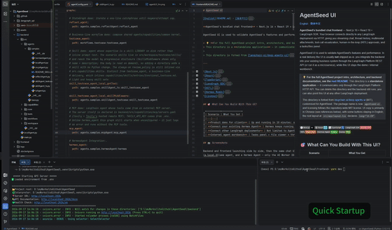
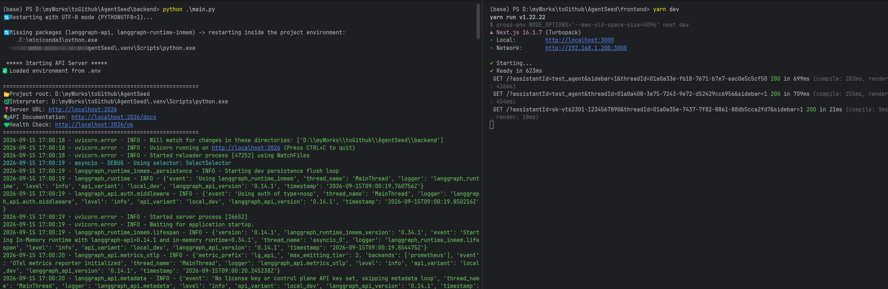
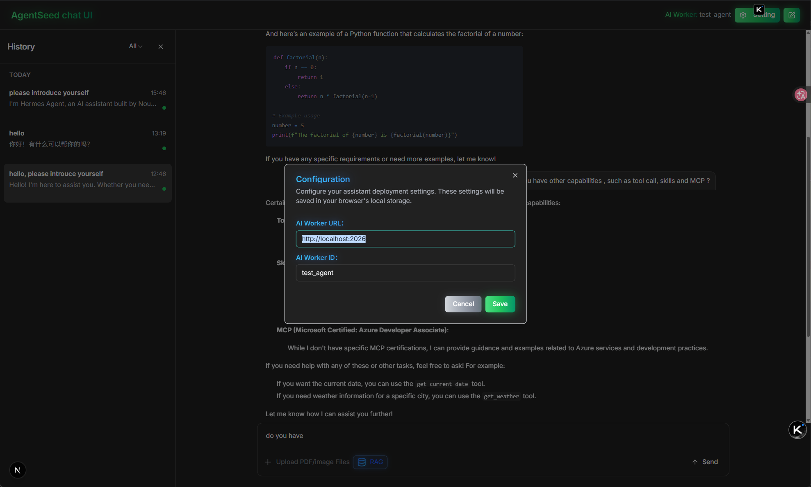
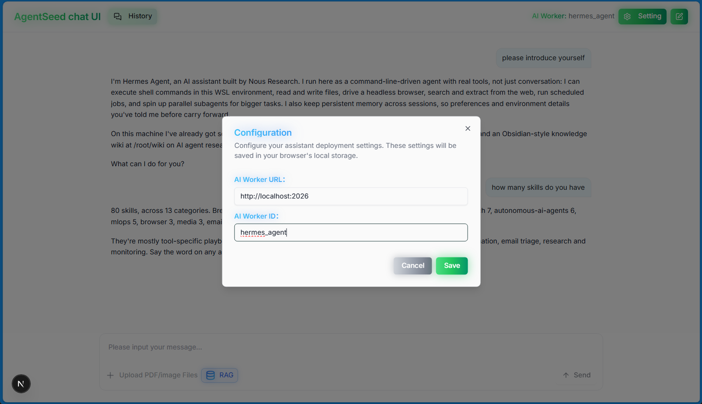
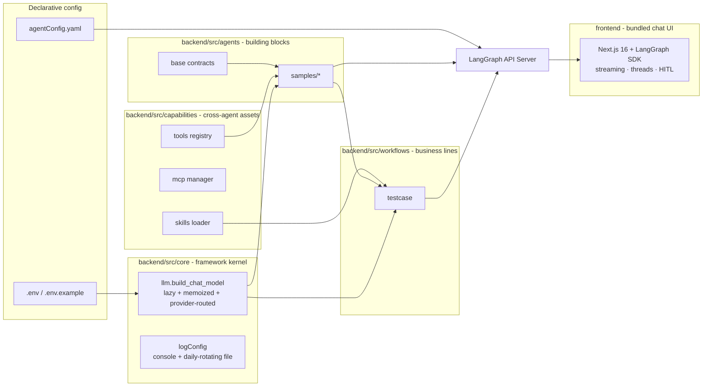

# AgentSeed

> **A full-stack, engineering-first agent framework on LangGraph.** A single command brings up a
> LangGraph API server that ships with a **shared LLM factory**, a **named tool registry**,
> **skill assets** (inlined or progressively disclosed) and **8 ready-to-call graphs** — but
> AgentSeed is *not* limited to
> wrapping chat models. Under the hood it speaks two protocols: it can run its own agent loop
> backed by any LLM (Ollama / OpenAI-compatible), **or** it can bridge to external
> agent-class systems such as **Hermes Agent** (already shipped as `hermes_agent`) and
> **OpenClaws** (planned), surfacing them as first-class LangGraph graphs alongside the
> LLM-native ones. The same repository also bundles its own **Next.js 16 chat UI**
> (`frontend/`) with streaming chat, thread history, tool-call visualisation,
> human-in-the-loop approvals and a task/file panel — no `langgraph.json`, no
> boilerplate code, no Docker and no `langgraph-cli` required — just Python and `uv`.

AgentSeed differentiator: Hermes bridging and dual-protocol compatibility. Most open-source agent frameworks on GitHub only run standalone LLM loops or exclusively support LangGraph. AgentSeed can connect to clients' existing HermesAgent, eliminating the need to rebuild legacy agent assets from scratch and building an irreplaceable technical moat.

<p align="center">
  
</p>

[English](README.md) · [简体中文](README-zh.md)


## 🎯 For Who (Who Should Use This)

| Role | Why AgentSeed |
|---|---|
| **Product Manager / Founder** | Bootstraps a working AI agent demo in **10 minutes** — chat UI, tool calls, human approval — to show clients or stakeholders. No Python deep-diving. |
| **Backend Engineer** | Swap LLM provider in **one `.env` line** (Ollama → DeepSeek → qwen → glm). **Zero code changes** — no hardcoded API URLs, no magic fallbacks. |
| **Teams already running Hermes Agent** | Keep your existing Hermes runtime (tools, skills, memory, sessions) — AgentSeed wraps it with a **polished chat UI + HITL approval + LangGraph monitoring**. You don't rewrite a thing. |
| **On-prem / Compliance-sensitive** | Defaults to a **local Ollama model** (`qwen2.5:7b`) — data never leaves your machine. Works fully offline, no API key required. |

## ✨ Why AgentSeed Over a Blank Script or a Heavy Platform

🤯 **Run it in 3 minutes** — `uv sync && uv run backend/main.py` brings up a real LangGraph API server with 8 callable graphs. Frontend is optional but bundled.
🔌 **Two protocols, one framework** — run your own agent loop backed by *any* LLM, **or** bridge to Hermes / OpenClaws / any OpenAI-compatible agent runtime. Both surfaces as first-class LangGraph graphs.
🧩 **Engineering scaffolding, not scaffolding burden** — shared LLM factory (memoized), named tool registry, markdown skill assets, daily-rotating logs, Windows UTF-8 fixes. You focus on agent logic.
🎨 **Chat UI included, not an afterthought** — streaming replies, thread history, tool-call inspection, HITL approve/edit/reject, PDF/image attachments. Talk to `test_agent` right after `yarn dev`.

---

## 🚀 Quick Start

What a successful launch looks like — backend on the left, frontend on the right:



### Prerequisites (install once)

| Tool | Version | Install | Why |
|---|---|---|---|
| Python | ≥ 3.12 | [python.org](https://www.python.org/downloads/) | LangGraph server runtime |
| uv | latest | [docs.astral.sh/uv](https://docs.astral.sh/uv/getting-started/installation/) | Fast Python dep management (replaces pip) |
| Node.js | ≥ 20 | [nodejs.org](https://nodejs.org/) | Next.js 16 frontend |
| Ollama | latest | [ollama.com](https://ollama.com/) | **Optional** — only for local LLM. Skip if you already have an OpenAI-compatible endpoint |

### Step 1 — Clone & configure

```bash
git clone https://github.com/yiyang-aistack/AgentSeed && cd AgentSeed
cp .env.example .env          # Defaults to local Ollama — no API key needed
```

### Step 2 — Launch backend (LangGraph API server)

```bash
ollama pull qwen2.5:7b        # Only if using local Ollama — once
uv sync && uv run backend/main.py
```

✅ **Verify** — open `http://localhost:2026/ok` → you should see `ok`  
✅ **Verify** — open `http://localhost:2026/docs` → Swagger UI with full LangGraph Platform API  
✅ **Verify** — list available graphs via curl:

```bash
curl -X POST http://localhost:2026/assistants/search \
  -H "Content-Type: application/json" -d '{"limit": 10}'
```

### Step 3 — Launch frontend (optional but recommended)

```bash
cd frontend && yarn install && yarn dev
```

✅ **Verify** — open `http://localhost:3000`  
✅ **Configure once** — in the setup dialog:
- AI Worker URL → `http://localhost:2026`
- AI Worker ID → `test_agent` (or any graph from `agentConfig.yaml`)



✅ **Try a tool call** — type *"What's the weather in Shanghai today?"* → you'll see the tool invocation card and its result.

### Step 4 — Docker (pull & run, no local Python/uv needed)

```bash
docker compose up -d --build
```

✅ **Verify** — open `http://localhost:2026/docs` → same server, same LangGraph Platform API, zero host dependencies.

- [`Dockerfile`](Dockerfile) is a **multi-stage** build: the `uv` environment is resolved from `uv.lock` in a `deps` stage, then only the venv + source land in the slim runtime image.
- [`docker-compose.yml`](docker-compose.yml) declares every **non-secret** default — `HOST=0.0.0.0`, `PORT=2026`, the in-memory LangGraph runtime, and local Ollama — so the demo boots with no local config.
- Drop your own `.env` next to `docker-compose.yml` and `env_file` layers it on top (LLM keys, Hermes, …). `environment:` still wins for `HOST`, so the container stays reachable even if `.env` says `localhost`.
- `hermes_agent` ships enabled in `agentConfig.yaml`, so the compose file supplies **placeholder** `HERMES_*` values just so the server starts. To actually use Hermes, set real values in `.env` (see [Configuration](#configuration)), or remove that graph — see [`.dockerignore`](.dockerignore) for what's excluded from the image.

---

## TL;DR

| | |
|---|---|
| **Real LangGraph API server, not a mock** | `uv run backend/main.py` starts the official LangGraph API Server (in-memory runtime + file persistence). `/assistants`, `/threads`, `POST /runs/stream`, `/docs` — all work out of the box. |
| **8 callable graphs** | `test_agent` · `agent2` · `reflect_agent` · `testcase_agent` · `skill_testcase_agent_local_getText` · `skill_testcase_agent_local_skillMiddleware` · `mcp_agent` · `hermes_agent`. Registered in [`agentConfig.yaml`](agentConfig.yaml), callable by name — these are exactly the ids `POST /assistants/search` returns. |
| **Runs fully offline** | Default provider is local **Ollama** (`qwen2.5:7b`) — no network, no API key. |
| **Switch LLM in one `.env` line** | Set `LLM_PROVIDER=openai` and point `OPENAI_BASE_URL` at *any* OpenAI-compatible endpoint (DeepSeek / qwen / glm …). **Zero code changes.** |
| **Bridge to Hermes Agent (no LLM rewrite)** | `hermes_agent` is a thin bridge — your existing Hermes Agent keeps its own tools/skills/memory; AgentSeed adds chat UI + HITL + LangGraph monitoring. |
| **Extension measured in minutes** | Add an agent = 1 Python file + 1 YAML line. Add a tool = `@tool` decorator + 1 registry entry. Add expert knowledge = 1 markdown file. |
| **Chat UI included** | Next.js 16 + React 19 + Tailwind: streaming replies, thread history, PDF/image attachments, tool-call inspection, HITL approve/edit/reject, file panel. See [`frontend/README.md`](frontend/README.md). |

---

## ✅ What's Already Working (Not a Prototype)

### Backend — LangGraph API Server
- [x] Local Ollama + OpenAI-compatible dual LLM support (0-code switch via `.env`)
- [x] **Hermes Agent bridge** — verified against Hermes Agent 0.20.6 OpenAI-compatible API; hardcodes nothing; missing required `.env` vars fail loudly
- [x] Shared LLM factory (`build_chat_model`) — memoized, globally reused, provider-routed
- [x] Named tool registry — cross-agent reuse, no copy-paste
- [x] Markdown skill assets — YAML front matter, loadable as prompts
- [x] **Progressive-disclosure skill libraries** — `deepagents` `SkillsMiddleware`: scenario skills stay out of the prompt until a task matches
- [x] 8 production-ready LangGraph graphs (see [Built-in graphs](#built-in-graphs))
- [x] MCP adapter — stdio + streamable-http/sse via `langchain-mcp-adapters`, `${VAR}` expansion from `.env`
- [x] Daily-rotating logs (Tomcat-style) with console colorlog
- [x] Windows UTF-8 auto-fix (`PYTHONUTF8=1` restart on first launch)
- [x] LangGraph file persistence — thread history survives restarts
- [x] Health check (`/ok`) + Swagger docs (`/docs`) ready out of the box

### Frontend — Next.js 16 Chat UI
- [x] Streaming chat (token-by-token, `Send ⇄ Stop` toggle)
- [x] Thread history sidebar (status filter, time grouping, delete)
- [x] Tool call visualisation (pending / completed / error badges, expandable args + results)
- [x] Human-in-the-loop — approve / edit / reject buttons, resumed via `command.resume.decisions`
- [x] Multi-modal attachments (JPEG · PNG · GIF · WEBP · PDF via picker / drag-drop / paste)
- [x] Auto-stick-to-bottom, responsive layout

## 🛣️ What's Next (Roadmap)

- [x] MCP adapter (stdio + streamable-http/sse) — see [MCP servers](#mcp-servers-wired--tavily-ships-enabled)
- [ ] OpenClaws Agent bridge — same pattern as Hermes (OpenAI-compatible)
- [x] Automated tests — 45 pytest cases in `backend/src/tests/` (`uv run pytest`, no network / no LLM required)
- [x] GitHub Actions CI ([`.github/workflows/ci.yml`](.github/workflows/ci.yml)) — backend: `ruff check` + `ruff format --check` + `pytest`; frontend: ESLint + `tsc --noEmit`
- [x] Dockerfile + one-command dev container (multi-stage build + `docker compose up`)
- [x] Screenshots — terminal launch, chat UI, Hermes bridge (see [Quick Start](#-quick-start))
- [ ] Demo GIF + one-click online demo
- [ ] More business workflows under `backend/src/workflows/`

---

## 🔌 Why Integrate External Agents (Hermes / OpenClaws)?

Many teams already run their own agent runtime — months of customized tools, skills, memory, and session management. **Rewriting everything in LangGraph is wasteful.** AgentSeed acts as the *unified entry point*:

1. **Don't touch your existing agent** — Hermes / OpenClaws keeps running its own tool loop with your customizations. AgentSeed doesn't replace it.
2. **Add polish for free** — your agent instantly gets a beautiful chat UI, HITL approvals, LangGraph's thread/run monitoring, and Swagger docs.
3. **Compose multi-agent workflows** — pair Hermes (deep reasoning) with a local Ollama agent (formatting output) in one LangGraph workflow.

Here is the *same* chat UI talking to a Hermes Agent — the only thing that changed is the AI Worker ID (`test_agent` → `hermes_agent`). No Hermes code was touched:



> **Verified**: Hermes Agent 0.20.6's OpenAI-compatible API works out of the box. Config lives entirely in `.env` (see [Configuration](#configuration)) — `hermesAgent.py` hardcodes no URL, token, or model ID.

---

## Why AgentSeed?

Agent repositories usually sit at one of two extremes: a 20-line script that cannot survive a day,
or a heavy framework you spend a weekend bending to your project. AgentSeed sits in the middle: the
**engineering scaffolding is already written** (config single source of truth, a lazily built shared
LLM, layered capabilities, daily-rotating logs, Windows UTF-8 handling), while the agent code stays
small enough to read in one go.

| | Hand-rolled script | Full-featured agent platform | **AgentSeed** |
|---|---|---|---|
| Directly callable REST API | ✗ | ✓ (tedious setup) | ✓ `uv run backend/main.py` |
| One global shared LLM instance | usually ✗ | ✓ | ✓ memoized factory |
| Tools reused across agents | ✗ (copy-paste) | ✓ | ✓ named registry |
| Prompt/knowledge as assets | inline strings | partial support | ✓ markdown skills, inlined *or* lazily disclosed |
| Swap provider without code changes | ✗ | partial support | ✓ `LLM_PROVIDER` |
| Daily rotating file logs | ✗ | ✗ | ✓ `logs/agentseed.log.YYYYMMDD` |
| Small enough to actually read | ✓ | ✗ | ✓ |
| Bundled chat UI in the same repo | ✗ | partial support | ✓ `frontend/` |

---

## Architecture



### Project layout

```
AgentSeed/
├── backend/                  # PYTHON SIDE — the LangGraph API server
│   ├── main.py               #   entrypoint: loads ../.env + ../agentConfig.yaml, starts uvicorn
│   ├── localAgent.py         #   standalone Ollama scratch script (never imported by the server)
│   └── src/
│       ├── __init__.py       #   documents the three orthogonal layers
│       ├── core/             #   KERNEL — domain-agnostic infrastructure
│       │   ├── llm.py        #     single source of truth for chat models
│       │   └── logConfig.py  #     uvicorn dictConfig + Tomcat-style daily rotation
│       ├── agents/           #   BUILDING BLOCKS — reusable/composable agent units
│       │   ├── base.py       #     AgentMeta + assert_agent_ready contracts
│       │   └── samples/      #     demo agents meant to be copied:
│       │       ├── localAgent.py    # create_agent + shared tools
│       │       ├── tsAgent.py       # a second independent agent
│       │       ├── reflectAgent.py  # hand-built StateGraph with a review/revise cycle
│       │       ├── mcpAgent.py      # tools loaded from an external MCP server
│       │       ├── skillAgent_testcase.py   # expertise = a skill library on disk
│       │       └── hermesAgent.py   # bridge to a running Hermes Agent (no LLM)
│       ├── capabilities/     #   CAPABILITIES — shared across every agent
│       │   ├── tools/registry.py    # @tool definitions + name→tool registry
│       │   ├── mcp/                 # MCP servers: servers.yaml + lifecycle manager (see below)
│       │   └── skills/entries/      # prompt/knowledge assets (markdown or .py)
│       ├── workspace/        #   AGENT WORKSPACES — on-disk material an agent reads at runtime
│       │   └── testcase/skills/     # scenario skill library (SKILL.md per directory)
│       └── workflows/        #   BUSINESS LINES — compose everything above
│           └── testcase/agent.py    # test-case generation delivery
├── frontend/                 # FRONTEND — Next.js 16 chat UI (see frontend/README.md)
├── agentConfig.yaml          # which graphs the server exposes  (name → module:attr)
├── .env.example              # every supported env var, documented      → copy to .env
├── pyproject.toml            # deps + uv config (script app, not an installable package)
├── Dockerfile                # multi-stage backend image (uv env + source)
├── docker-compose.yml        # `docker compose up` — non-secret defaults + env_file
├── .dockerignore             # keeps .env / .venv / frontend / logs out of the image
└── logs/                     # daily-rotating runtime logs (git-ignored)
```

> 💡 **Core design principle — one concept, one directory.**
> `agents` holds *reusable components* (e.g. localAgent, hermesAgent). `workflows` holds
> *purpose-built deliveries* (e.g. testcase_agent). They never duplicate content. `capabilities`
> sits alongside both so that any agent or workflow can attach tools / MCP / skills without
> cross-importing another agent. Change one agent, nothing else breaks.
>
> `workspace` is the fourth kind: **data an agent reads while it runs**, not code it imports. A
> scenario skill library lives there so it can be edited as content — add a directory, get a skill —
> without touching Python.

Content under `backend/src` is addressed two ways: Python code imports `src.*` (which puts
`backend` on `sys.path`), while `agentConfig.yaml` addresses `agents.*` / `workflows.*` (which puts
`backend/src` on `sys.path`). `backend/main.py` establishes both — that is why this document always
uses `uv run backend/main.py`.

`frontend/` honours the same rule from the other side: it is a **separate application, not a Python
package of this project**, and talks to the backend only through the LangGraph Platform HTTP API —
delete the directory and the backend still runs on its own.

---

## Built-in graphs

All of them are registered in [`agentConfig.yaml`](agentConfig.yaml); each graph is resolved via
`module.__dict__[variable]` and then served by the same API:

| Graph ID | Source | What it demonstrates |
|---|---|---|
| `test_agent` | `agents.samples.localAgent:test_agent` | The smallest `create_agent`, bound to the shared tool registry |
| `agent2` | `agents.samples.tsAgent:ts_agent` | A second independent agent reusing the same memoized LLM |
| `reflect_agent` | `agents.samples.reflectAgent:reflect_agent` | Hand-built `StateGraph`: typed state, conditional edge, bounded review/revise loop |
| `testcase_agent` | `workflows.testcase:testcase_agent` | A business-line workflow composing kernel + tools + skills |
| `skill_testcase_agent_local_getText` | `agents.samples.skillAgent_ts:skill_testcase_agent` | Expertise is a skill library **inlined** into the prompt (`src.capabilities.skills.get_texts`) |
| `skill_testcase_agent_local_skillMiddleware` | `agents.samples.skillAgent_testcase:skill_testcase_agent` | Expertise is a skill *library* on disk, loaded by progressive disclosure — see [Add a skill](#add-a-skill) |
| `mcp_agent` | `agents.samples.mcpAgent:mcp_agent` | Tools come from an external MCP server (`servers.yaml` → Tavily); runs degraded instead of failing when that server is unreachable |
| `hermes_agent` | `agents.samples.hermesAgent:hermes` | Bridge to a running Hermes Agent (OpenAI-compatible API); no LLM is configured on this side |

---

## Usage

### 1. REST (the standard LangGraph Platform API)

```bash
# List the registered graphs (assistants)
# NOTE: a bare `GET /assistants` returns 405 — the search endpoint is a POST
curl -X POST http://localhost:2026/assistants/search \
  -H "Content-Type: application/json" -d '{"limit": 10}'

# Stream one run of a graph
curl -X POST http://localhost:2026/runs/stream \
  -H "Content-Type: application/json" \
  -d '{
        "assistant_id": "test_agent",
        "input": { "messages": [{"role": "user", "content": "What is the weather in Shanghai today?"}] }
      }'
```

### 2. Interactive docs & UI

| URL | Purpose |
|---|---|
| `http://localhost:2026/docs` | OpenAPI / Swagger — call every endpoint from the browser |
| `http://localhost:2026/ok` | Health check |
| `/assistants`, `/threads`, `/runs/*` | The full LangGraph Platform API (browsable in `/docs`) |

> **About the server's own `/ui`:** it is not available here. `langgraph_api` only assembles a
> Studio bundle when the internal `LANGGRAPH_UI` variable exists (normally injected by the langgraph
> CLI from `langgraph.json`) **and** Node.js/`npx` is present on the machine. AgentSeed never sets
> `LANGGRAPH_UI`, so `LANGGRAPH_UI_BUNDLER=true` on its own does not make `/ui` work — use the
> bundled chat UI below instead.

### 3. Browser chat UI (`frontend/`)

```bash
cd frontend
yarn install
yarn dev          # → http://localhost:3000
```

The **Configuration** dialog shown on first load stores its values in `localStorage` (key:
`agentseed-config`). The URL must be reachable **from the browser**:

| Field | Local value |
|---|---|
| AI Worker URL | `http://localhost:2026` |
| AI Worker ID | any graph id from `agentConfig.yaml`, e.g. `test_agent` |

### 4. Python (in-process)

```python
from src.core.llm import build_chat_model
from src.capabilities.tools import builtin

model = build_chat_model()            # globally shared, memoized instance
tools = builtin(["weather", "current_date"])
```

---

## Bundled chat UI (`frontend/`)

`frontend/` is a **Next.js 16 (App Router) + React 19 + Tailwind/shadcn** client built on the
LangGraph SDK and customised from
[langchain-ai/deep-agents-ui](https://github.com/langchain-ai/deep-agents-ui) (MIT).

| Capability | Detail |
|---|---|
| Streaming chat | `useStream` from `@langchain/langgraph-sdk`, auto stick-to-bottom, `Send ⇄ Stop` |
| Threads | `threadId` persisted in the URL; history sidebar with status filter, time grouping, paging and delete |
| Attachments | JPEG · PNG · GIF · WEBP · PDF via picker, drag-and-drop or paste; images travel as `image_url`, PDFs as `additional_kwargs.attachments` |
| Tool calls | pending / completed / error badges with expandable arguments and results; `task` calls render as sub-agent cards |
| Human-in-the-loop | approve / edit / reject buttons derived from `review_configs[].allowed_decisions`, resumed through `command.resume.decisions` |
| Tasks & files | live `todos` grouped by state, plus a file viewer/editor with syntax highlighting and download |
| GenUI | backend-supplied components rendered through `LoadExternalComponent` |

The complete feature list, UI copy and troubleshooting table live in
[`frontend/README.md`](frontend/README.md) (中文版: [`frontend/README.zh-CN.md`](frontend/README.zh-CN.md)).

---

## Configuration

All static configuration lives in `.env` (copy it from [`.env.example`](.env.example)); graph
wiring lives in `agentConfig.yaml`. **Only `PORT` is mandatory** — when it is missing the server
stops with an explicit error.

| Variable | Default | Purpose |
|---|---|---|
| `HOST` / `PORT` | `localhost` / `2026` | Bind address; use `0.0.0.0` only on trusted networks |
| `LLM_PROVIDER` | `local` | `local` → Ollama; `openai` → any OpenAI-compatible endpoint |
| `OLLAMA_BASE_URL` / `OLLAMA_MODEL` / `OLLAMA_TEMPERATURE` | `http://127.0.0.1:11434` / `qwen2.5:7b` / `0.2` | Local model |
| `OPENAI_API_KEY` / `OPENAI_BASE_URL` / `OPENAI_MODEL` / `OPENAI_TEMPERATURE` | – / `https://api.deepseek.com/v1` / `deepseek-flash` / `0.2` | Online model (active when `LLM_PROVIDER=openai`) |
| `HERMES_BASE_URL` / `API_SERVER_KEY` / `HERMES_MODEL` / `HERMES_TIMEOUT` (required) + `HERMES_MAX_RETRIES` (optional) | – (all supplied by `.env`) | Hermes Agent bridge (`hermes_agent`): API-server root, bearer token, model id, per-turn timeout and retry ceiling. Nothing is hardcoded in `hermesAgent.py`; the timeout is required because an absent one means "wait forever" in the OpenAI client, while an empty optional value keeps the client's own default |
| `TAVILY_API_KEY` | – (empty) | Credential for the `tavily` MCP server, expanded into `servers.yaml` and sent as `Authorization: Bearer …` to `https://mcp.tavily.com/mcp/`. Empty = `mcp_agent` logs an error and runs without MCP tools; **no other graph is affected** |
| `LOG_LEVEL` / `LOG_DIR` / `LOG_BACKUP_COUNT` | `DEBUG` / `./logs` / `0` | Console + file logging |
| `LANGGRAPH_RUNTIME_EDITION` / `DATABASE_URI` / `REDIS_URI` | `inmem` / `:memory:` / `fake` | Local in-memory runtime, no external services required |
| `LANGGRAPH_UI_BUNDLER` | `true` | Server-side Studio bundler switch. `/ui` additionally needs `LANGGRAPH_UI` (injected by the langgraph CLI) and Node.js, so it stays unavailable here — use the bundled UI in `frontend/` |

**Common pitfalls**

- `.env` is the single source of truth and is loaded with `override=True`, so it wins over
  same-named variables already present in the process environment.
- **Never put a `#` comment directly after a value.** `python-dotenv` only treats `#` as a comment
  when it is preceded by whitespace, so `OPENAI_API_KEY=sk-abc#note` is read as the whole value and
  authentication fails.
- `.env` is already in `.gitignore`; never write real keys into `.env.example`.
- `hermes_agent` requires a locally running Hermes Agent with its API server enabled (on the Hermes
  side `API_SERVER_ENABLED=true`, with the key mirrored into `API_SERVER_KEY`). It does not use
  `LLM_PROVIDER` / `OLLAMA_*` / `OPENAI_*` at all, and it hardcodes nothing in Python:
  `HERMES_BASE_URL`, `API_SERVER_KEY` and `HERMES_MODEL` must be present in `.env`, otherwise the
  module raises at startup with `HERMES_… is not set` — drop that entry from `agentConfig.yaml`
  when you do not need Hermes.
- **Run `uv run backend/main.py` from the repository root.** `backend/main.py` puts both
  `<repo>/backend` (so modules can `import src.*`) and `<repo>/backend/src` (so `agentConfig.yaml`
  can address `agents.*` / `workflows.*`) on `sys.path`, and anchors the working directory to the
  repository root, so `.env`, `agentConfig.yaml`, `logs/` and `.langgraph_api/` always resolve to
  the same place. Invoking `uvicorn langgraph_api.server:app` directly skips all of that and fails
  with `ModuleNotFoundError: src`.

---

## Extending AgentSeed

### Add an agent (3 steps)

```python
# 1) backend/src/agents/samples/myAgent.py
from langchain.agents import create_agent

from src.capabilities.tools import builtin
from src.core.llm import build_chat_model

my_agent = create_agent(
    model=build_chat_model(),                 # shared, memoized
    tools=builtin(["weather", "current_date"]),
    system_prompt="You are a concise assistant.",
)
```

```yaml
# 2) agentConfig.yaml
graphs:
  my_agent:
    path: agents.samples.myAgent:my_agent     # module:variable
```

```bash
# 3) uvicorn already runs with reload=True — saving is enough, the graph is served as /my_agent
```

> ⚠️ **The number-one trap in this framework:** the variable in `module:variable` must be a **real
> module-level attribute**. `langgraph_api` resolves graphs with `module.__dict__[spec.variable]`,
> which never triggers PEP 562 `__getattr__`; a lazy-only export makes the server die at startup
> with `Could not find graph 'my_agent'`.

### Add a tool

```python
# backend/src/capabilities/tools/registry.py
@tool
def get_exchange_rate(base: str, quote: str) -> str:
    """Return the mock FX rate between two currencies."""
    return f"1 {base} = 7.20 {quote}"

_BUILTINS["fx"] = get_exchange_rate
```

From then on any agent can pull it by name (`builtin(["fx"])`) — no duplicated definitions, no
per-agent copies.

### Add a skill

There are **two** skill mechanisms here. They answer different questions, and picking the wrong one
is the main way to get this wrong.

| | `capabilities/skills/entries/` | `workspace/<scenario>/skills/` |
|---|---|---|
| Loader | `get_texts(["name"])` | deepagents `SkillsMiddleware` |
| Delivery | Inlined into the system prompt — **always** present | Metadata in the prompt, body read on demand |
| Cost | Paid on **every** request | Paid only when a skill actually applies |
| Use for | A short policy that always applies | A library of scenarios that keeps growing |

**1. Inlined assets — right for an always-on policy.** Dependency-free, and the whole body goes
into the prompt:

```markdown
<!-- backend/src/capabilities/skills/entries/code_review.md -->
---
name: code_review
description: Review guidance for generated code
tools: []
---
Prefer the smallest correct change; never reformat unrelated code. ...
```

```python
from src.capabilities.skills import get_texts

system_prompt = "Follow this policy:\n" + get_texts(["code_review"])[0]
```

`.py` modules exporting `SKILL_TEXT` / `SKILL_META` work too, for programmatic generation.

**2. Scenario libraries — right for skills that accumulate.** A skill is a directory with a
`SKILL.md`. Only its `name` and `description` reach the prompt; the model pulls the body in with
`read_file` when a task matches:

```markdown
<!-- backend/src/workspace/testcase/skills/boundary-analysis/SKILL.md -->
---
name: boundary-analysis
description: "Use when inputs have numeric or length limits and the edges need probing."
---
# Boundary analysis
...
```

```python
from pathlib import Path
from deepagents.backends.filesystem import FilesystemBackend
from deepagents.middleware.filesystem import FilesystemMiddleware
from deepagents.middleware.skills import SkillsMiddleware

skills_root = Path("backend/src/workspace/testcase").resolve()
skills_backend = FilesystemBackend(root_dir=skills_root, virtual_mode=True)

create_agent(
    model=llm, tools=[],
    middleware=[
        FilesystemMiddleware(backend=skills_backend, tools=["ls", "read_file", "glob", "grep"]),
        SkillsMiddleware(backend=skills_backend, sources=["/skills/"]),
    ],
    system_prompt=SYSTEM_PROMPT,
)
```

Three things to know before you copy this:

- **`FilesystemMiddleware` is required, not optional.** The skills prompt tells the model to load a
  body with `read_file`; without it, every skill is announced and then turns out to be unreadable.
- **`tools=` is what keeps it read-only.** `FilesystemMiddleware` defaults to the *whole* toolset —
  `write_file`, `edit_file`, `delete` **and `execute`**. Any agent published over HTTP should narrow
  that, as above.
- **`virtual_mode=True` confines reads to `skills_root`.** `..` traversal raises
  `ValueError: Path traversal not allowed`, so `.env` at the repository root is unreachable.

Both are live in
[`skillAgent_testcase.py`](backend/src/agents/samples/skillAgent_testcase.py): the *scenario library*
is [`workspace/testcase/skills/`](backend/src/workspace/testcase/skills/) (requirement analysis,
test-case design, output formatting), and the *always-on* part is the repo-wide `review_policy`,
inlined via `get_texts` so it cannot be skipped by a model that decides not to read a skill.

> **Why both in one agent?** A policy the agent must never forget belongs in the prompt. A library
> of techniques it consults selectively should not. Putting the policy in the library would make
> forgetting it possible; putting the library in the prompt would mean every request pays for
> material it does not need. The two mechanisms exist to let you choose per asset — see
> [`entries/functional_testcase.md`](backend/src/capabilities/skills/entries/functional_testcase.md)
> for the version inlined into `testcase_agent`, and the `SKILL.md` files above for the lazy one.

### MCP servers (wired — Tavily ships enabled)

`backend/src/capabilities/mcp/` connects to real MCP servers. `langchain-mcp-adapters` is a
declared dependency, so **both** transports work: `stdio` (the server runs as a subprocess) and
`streamable-http` / `sse` (a remote endpoint). Declaring one is config-only:

```yaml
# backend/src/capabilities/mcp/servers.yaml
servers:
  tavily:                          # ← ships enabled; backs the mcp_agent graph
    transport: streamable-http
    url: https://mcp.tavily.com/mcp/
    headers:
      Authorization: "Bearer ${TAVILY_API_KEY}"   # ${VAR} expands from .env
    enabled: true
```

```python
from src.capabilities.mcp import tools

mcp_tools = tools("tavily")   # -> list[BaseTool], ready for create_agent
```

Three properties are worth knowing:

- **Secrets never enter YAML.** Any `${VAR}` in `servers.yaml` is expanded from the process
  environment (i.e. `.env`). A placeholder that resolves empty — including one left blank —
  raises `MCPConfigError` *before* a connection is attempted, so the message names the variable
  and "never configured" stays distinguishable from "configured but unreachable".
- **No idle connections.** `langchain-mcp-adapters` opens a fresh session per tool call, so the
  manager caches only the client config; nothing holds a socket open between calls.
- **Tools are plain `BaseTool`s.** An agent binds them exactly like registry tools — see
  [`mcpAgent.py`](backend/src/agents/samples/mcpAgent.py), which never mentions MCP, HTTP or
  Tavily. Swapping providers is a `servers.yaml` edit.

`mcp_agent` is the one graph that **degrades instead of refusing to start**: Tavily is a remote
third-party endpoint, so an unreachable network or an unset key logs an ERROR and builds the
agent without MCP tools rather than taking down the other graphs. The system prompt says so too,
so the model reports it cannot search instead of inventing an answer. (`hermes_agent` fails
loudly by contrast — its missing settings are static config only you can supply.)

---

## 🛡️ Engineering Trust — Built for Real Environments

 *"Will this break when I run it?"* Here's why AgentSeed isn't a toy script:

### Configuration & Security
- **Zero hardcoded secrets** — every URL, token, model ID, and timeout lives in `.env`. `hermesAgent.py` hardcodes nothing (no API key, no host). A missing required var fails loudly at startup, not silently at runtime.
- **API keys in `SecretStr`** — Pydantic's `SecretStr` prevents tokens from leaking into logs, `repr()`, or error messages.
- **`.env` already in `.gitignore`** — real keys never accidentally enter git history. `.env.example` uses placeholders only.
- **Single source of truth** — `.env` loaded with `override=True` wins over process env, so you always know which value is active.

### Cross-Platform Reliability
- **Windows GBK fix** — `backend/main.py` detects Windows and re-executes with `PYTHONUTF8=1`, eliminating the common `UnicodeDecodeError: 'gbk' codec can't decode` trap.
- **Auto venv switching** — started with the wrong Python interpreter (system Python, conda base)? `main.py` auto-detects and re-executes inside `<repo>/.venv`. No more `ModuleNotFoundError`.
- **uv-locked deps** — `uv.lock` committed *and enforced*: CI runs `uv lock --check` + `uv sync --locked`, and the Docker build syncs with `--locked` too, so a lockfile that drifted from `pyproject.toml` fails the pipeline instead of silently installing older versions. No "works on my machine".

### Observability
- **Daily-rotating file logs** — `logs/agentseed.log` → `agentseed.log.20260915` (Tomcat `catalina` semantics). Set `LOG_BACKUP_COUNT` for auto-cleanup.
- **Console colorlog** — pretty colored output when `colorlog` is installed, degrades gracefully without it.
- **Swagger UI built-in** — `http://localhost:2026/docs` for live API exploration.

### Platform notes (edge cases)

- `SKIP_UTF8_RESTART=1` in process env skips the Windows UTF-8 restart (useful under pdb / pytest).
- `SKIP_VENV_RESTART=1` in process env skips the auto-venv switch (useful when attaching a debugger).
- `logs/` is git-ignored and excluded from uvicorn reload — writing a log line never restarts the server.

A sample log output:

```
2026-09-12 10:04:11 - langgraph_api.server - INFO - Starting server on localhost:2026
2026-09-12 10:04:12 - agentseed.agents.base - DEBUG - Agent 'test_agent' loaded
```

---

## Contributing

Issues and PRs are welcome. Two conventions keep the code tree healthy, and both are already written
down in
[`backend/src/capabilities/skills/entries/review_policy.md`](backend/src/capabilities/skills/entries/review_policy.md):

1. **One concept, one directory** — never create a second "home" for agents or tools.
2. **Lazy and safe at import** — no network/IO as an import side effect; use the canonical
   `src.core.llm` factory instead of building your own client.

## Acknowledgements

Built on the shoulders of [LangGraph](https://github.com/langchain-ai/langgraph),
[LangChain](https://github.com/langchain-ai/langchain), [Ollama](https://ollama.com) and
[uv](https://github.com/astral-sh/uv). The daily-rotating file handler follows Tomcat's `catalina`
log semantics. The bundled chat UI is a customised fork of
[deep-agents-ui](https://github.com/langchain-ai/deep-agents-ui)
(MIT, Copyright (c) 2025 LangChain).

## 💬 Want a Custom Build?

AgentSeed is a starting point. If you need help adapting it to your business — integrating your
internal tools, customizing the chat UI, adding production deployment (Docker + Nginx + TLS),
or composing multi-agent workflows — feel free to reach out.

- **Upwork**: [https://www.upwork.com/freelancers/~01206648ba3c9e3bfe]
- **GitHub Issues**: [open an issue](../../issues)
- **Email**: [ [titanai@qq.com](mailto:titanai@qq.com)]

## License

MIT — see [LICENSE](LICENSE). `frontend/` keeps its upstream MIT notice
(Copyright (c) 2025 LangChain) alongside this project's own copyright.